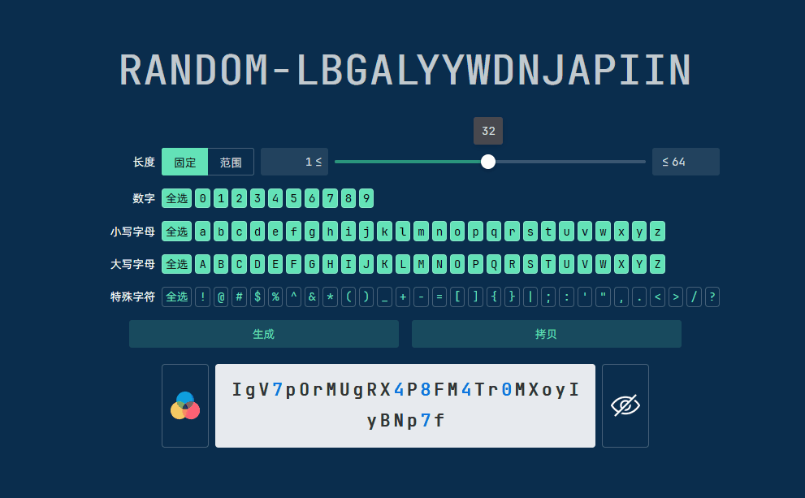

# Random String Generator

<div align="center">
  
  
  
  
</div>

## 1. 介绍

虽然网上有很多随机字符串生成器，但缺点有以下几点：

- 不安全：既然是在线生成，那么生成的字符串就有可能被纪录。
- 无法自定义：长度、字符集无法细粒度自定义。
- 无隐私性：生成的字符串无法隐藏显示，可能会被他人看到。
- 无法保存：设置好的配置无法持久化到浏览器。
- 界面不美观：界面不美观，操作不方便。

本项目是一个再简单不过的随机字符串生成器，简单到无需多介绍，但轮子再小也有它的价值。



## 2. 特点

- 安全性：生成的字符串不会被纪录，你可以离线使用。
- 自定义：长度（固定还是随机范围）、字符集（字符级调整）等都可以自定义。
- 隐私性：生成的字符串可以隐藏显示，防止被他人看到。
- 持久化：设置好的配置会持久化到浏览器，下次打开时会自动加载。
- 美观：界面美观，操作方便。

## 3. 使用

### 3.1 在线使用

你可以打开开源社区托管网站在线使用：

- GitHub
  Pages: [https://jiang-taibai.github.io/random-string-generator/](https://jiang-taibai.github.io/random-string-generator/)
- Gitee
  Pages: [https://jiang-taibai.gitee.io/random-string-generator/](https://jiang-taibai.gitee.io/random-string-generator/)

### 3.2 使用离线 HTML

你可以下载本项目的发行版压缩包，然后在浏览器中打开压缩包内的 `index.html` 文件即可。

- GitHub
  Release: [https://github.com/jiang-taibai/random-string-generator/releases](https://github.com/jiang-taibai/random-string-generator/releases)
- Gitee
  Release: [https://gitee.com/jiang-taibai/random-string-generator/releases](https://gitee.com/jiang-taibai/random-string-generator/releases)

### 3.3 使用源码

你可以下载本项目的源码，确保你的电脑上已经安装了 Node.js 环境，然后执行以下命令：

```bash
git clone https://github.com/jiang-taibai/random-string-generator.git
cd random-string-generator
npm install
vite
```

然后打开浏览器访问 `http://localhost:5173` 即可（默认端口为 5173，以控制台显示为准）。

## 4. 鸣谢

本项目使用了以下开源项目：

- [Node.js](https://nodejs.org/)
- [Vite](https://vitejs.dev/)
- [Vue.js](https://vuejs.org/)
- [Naive UI](https://www.naiveui.com/)

本项目使用到了以下资源：

- [JetBrains Mono](https://github.com/JetBrains/JetBrainsMono)
- [阿⾥巴巴字体](https://www.alibabafonts.com/#/font)

## 5. 未来计划

- [ ] 批量生成：一次生成多个字符串。

## 6. 开源协议

本项目遵循 [MIT](https://opensource.org/licenses/MIT) 开源协议。

CopyRight © 2024~Present [Jiang Liu](https://coderjiang.com)